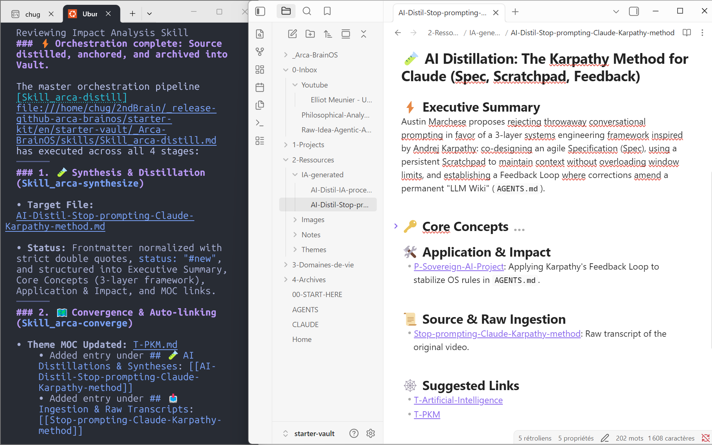
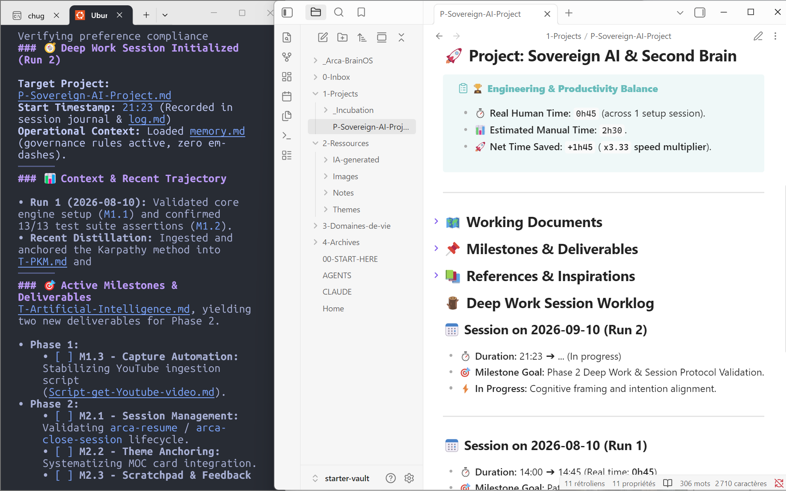

# 🧠 Arca-BrainOS

<p align="center">
  
</p>

> *"My ark is not a refuge, it is an engine... Dreams conceive, but only action accomplishes."*  
> **Fernando Pessoa**  
>  
> *(Inspired by Fernando Pessoa's famous wooden trunk, "A Arca", containing thousands of fragments, manuscripts, and heteronyms waiting to become a universe. Arca-BrainOS is that execution engine for your digital mind.)*

---

**A sovereign, local AI assistant for your projects and life notes**

🇫🇷 **[Lire la version française (README.fr.md)](README.fr.md)**

[](https://obsidian.md)
[](LICENSE)
[](#-key-design-principles)
[](#-proven-field-roi--speed-x4)

**[Quickstart](#-quickstart-1-minute-onboarding)** · **[Getting Started](GETTING_STARTED.md)** · **[Manifesto](MANIFESTO.md)** · **[Architecture](#-architecture--vault-topography-decoupled-design)** · **[Contributing](CONTRIBUTING.md)**

---

> 🎯 **Core Concept:** Keep your notes and personal memory at home, outside captive platforms. Arca-BrainOS equips your AI assistants (CLI agents like Claude Code, Antigravity, OpenCode, or desktop workspaces like Claude Cowork and Gemini Spark) with persistent memory directly in your local Markdown files. You retain 100% data ownership and the complete freedom to switch AI models anytime without losing your context.

---

## 💥 The Problem: The Gap Between Human Thought and AI Agents

1. **Systematic AI agent amnesia:** Whether running in terminal CLI (Claude Code, Antigravity, OpenCode) or desktop workspaces (Claude Cowork, Gemini Spark), AI agents are remarkably capable but amnesic. Every new session wipes away business context, forcing you to restart from scratch.
2. **The note-keeping maintenance trap:** Organizing personal data and notes often turns into an administrative nightmare: endless manual sorting, tedious link maintenance, and wasted hours tinkering with tools instead of making progress on real projects.
3. **Lock-in inside proprietary silos:** Trusting personal memory to closed cloud platforms fragments your data, creates captive dependencies, and compromises intellectual sovereignty.

---

## 🛡️ The Solution: Arca-BrainOS

**Arca-BrainOS** is an open-source, agentic operating system designed for **Obsidian** (and any local Markdown editor). It equips your workspace (terminal CLI, Claude Cowork, Gemini Spark) with a fleet of **autonomous skills (`Skill_arca-*.md`)** that handle documentation chores, maintain the ontology of your knowledge, and steer your Deep Work sessions.

The system articulates two complementary dimensions of your projects:
- **Intellectual & digital projects:** Software engineering, systems architecture, research, and writing.
- **Real-world action projects:** Home renovations, vacation or trekking trips, health and rehabilitation routines, or creative crafts.

Each project dynamically links to your **Life Areas (`3-Domaines-de-vie/`)** to balance your energy and power your seasonal reviews.

> 📜 **Philosophy & Vision:** To understand the anthropological mutation, Stiegler's *Pharmakon*, and the refusal of closed AI monopolies, read **[The Sovereign AI Workflow Manifesto (MANIFESTO.md)](MANIFESTO.md)**.

<p align="center">
  
  <br>
  <em>Show, don't tell: CLI terminal orchestration on the left, structured Obsidian note wired to thematic cards on the right.</em>
</p>

#### 🎯 The 4 Pillars of Arca-BrainOS:

- **📥 1. Ingestion & Distillation (Automated & Extensible):** Immediate capture and conceptual synthesis of raw inputs (web articles, YouTube videos, podcasts, voice memos). Extensible via MCP (Model Context Protocol) connectors to hook into your existing tools: email inbox, messaging apps (WhatsApp, Telegram), or task managers.
- **🗂️ 2. Organization & Weaving (Assisted):** Smart note management: the AI creates and maintains relevant links between notes (`[[...]]`), then automatically anchors them to your thematic cards and Life Areas, with zero manual filing effort.
- **🚀 3. Deep Work & Execution (Human Focus):** Previous session recap, active focus framing (`arca-resume`), continuous worklog tracking, and time saved measurement (`arca-close-session`).
- **🩺 4. Audit & Vault Health (Supervised):** Proactive orphan note detection, broken link repair, and transversal semantic exploration (`arca-query`).

---

## ⚡ Proven Field ROI: Speed x4

Arca-BrainOS is grounded in **real empirical data**, continuously tracked across 24 actual projects and over 160 Deep Work sessions:

| Key Metric | Measured Result | Field Impact |
| :--- | :---: | :--- |
| **Speed Multiplier** | **⚡ x4** | Projects move 4x faster |
| **Net Time Saved** | **🚀 +434 hours** | Over 10 weeks of intellectual work liberated |
| **Real Time Invested with AI** | **152h** | Instead of ~587h estimated manual work |

> 💡 **Real-World Context:** Measured on a pre-existing personal vault containing hundreds of notes, not an empty sandbox demo.

---

## 💎 Key Design Principles

1. **🔒 Sovereign & Local-First:** Plain-text Markdown files (`.md`) on your local disk. Zero SaaS lock-in, complete and perpetual data ownership.
2. **🤖 Runner & LLM-Agnostic:** Works seamlessly in terminal CLI (Google Antigravity, Claude Code, OpenCode) and desktop assistants with local file access (Claude Cowork, Gemini Spark, Codex), or 100% local models via Ollama. Switch tools freely without friction.
3. **🧠 Persistent Inter-Session Memory:** Your vault becomes the long-term memory of the AI agent, eradicating amnesia between runs.
4. **🤝 Non-Destructive Symbiosis:** AI manages administrative friction and enriches connections. It never alters or rewrites human style or human-authored content.

<p align="center">
  
  <br>
  <em>Deep work session framing with arca-resume and automated project worklog directly inside Obsidian.</em>
</p>

---

## 📂 Architecture & Vault Topography (Decoupled Design)

Arca-BrainOS uses a **strictly decoupled 2-part architecture**:

1. **Part A: Core OS Engine (`_Arca-BrainOS/`):** 100% portable container grouping modular skills (`skills/`), process guides, note templates, architecture decision records (`adr/`), and test suites.
2. **Part B: Your Personal Content (Existing or fresh vault):** Your notes and folders. Arca-BrainOS adapts to your own folder structure via configurable path variables in `AGENTS.md`.

```text
Your-Obsidian-Vault/
├── _Arca-BrainOS/                # 🧠 PART A: Core Engine Container (100% Portable)
│   ├── AGENTS.md                 # System configuration & path variables
│   ├── log.md                    # Single-line audit log (1 line / action)
│   ├── skills/                   # 🔌 Modular Agentic Skills (Skill_arca-*.md)
│   ├── process/                  # 📚 Methodological Guides (Process-*.md)
│   ├── templates/                # 📄 Note Templates (Project, Theme, Area, ADR)
│   ├── adr/                      # 📜 Architecture Decision Records (ADR-001...)
│   └── tests/                    # 🧪 Agentic Test Harness & Fixtures
│
├── Home.md                       # Optional Executive Cockpit (Included in starter-vault)
├── 0-Inbox/                      # 🧠 PART B: Your 2nd Brain Content (Configurable)
├── 1-Projects/                   # Active Projects (P-...) & Incubation (_Incubation/)
├── 2-Ressources/                 # Knowledge Base (Notes/, IA-generated/, Themes/)
├── 3-Domaines-de-vie/            # Permanent Life Areas (README.md index)
└── 4-Archives/                   # Completed Projects & Inactive Areas
```

---

## ⚡ Quickstart (1-Minute Onboarding)

> 💡 **Detailed Operational Guide:** Looking for a step-by-step onboarding walkthrough? Read **[GETTING_STARTED.md](GETTING_STARTED.md)**.

### 1. Prerequisites
* **[Obsidian](https://obsidian.md)**
* **An AI Assistant or Runner:** Terminal CLI (**Google Antigravity**, **Claude Code**, **OpenCode**) or desktop workspace (**Claude Cowork**, **Gemini Spark**, **Codex**).
* *(Optional)* **[Dataview Plugin](https://github.com/blacksmithgu/obsidian-dataview)**: Required only if you use the visual cockpit in `Home.md`.

### 2. Installation (Choose Option A or Option B)

#### 📁 Option A: Add to an EXISTING Obsidian Vault
Copy the engine folder `starter-kit/en/_Arca-BrainOS/` to the root of your existing vault. Launch your AI terminal and paste the instruction:
```text
Read https://github.com/Arca-Brain/Arca-BrainOS/blob/main/INSTALL.md (or local INSTALL.md) and install Arca-BrainOS for me.
```
*The agent discovers your paths, configures `AGENTS.md`, and runs verification tests without modifying your existing notes.*

#### 📦 Option B: Fresh Start with a Ready-to-Use Vault
Open the `starter-kit/en/starter-vault/` folder directly as a new vault in Obsidian.
> 💡 Open the welcome note **`00-START-HERE.md`** at the root to test your first 3 commands in under 5 minutes.

### 3. Verification Test
In your AI terminal runner, run:
```bash
arca-test
```
*The agent executes automated assertions to verify system integrity and path resolution.*

---

## 📜 Open-Source License

Arca-BrainOS is open-source software licensed under the **[MIT License](LICENSE)** (see [`LICENSE.md`](LICENSE.md)).

This permissive license guarantees frictionless adoption, complete enterprise compatibility, and the preservation of a shared digital commons.

---

## 🙏 Acknowledgments & Inspirations

Arca-BrainOS builds upon the pioneering work of **David Allen** (GTD), **Tiago Forte** (BASB & PARA), **Sönke Ahrens** (Zettelkasten), **Daniel Miessler** (PAI & UNIX architecture), **Bernard Stiegler** (Pharmakon), **Eliott Meunier**, and the open-source **Obsidian** community.

---

<p align="center">
  <i>Built with passion by Hugues & the Arca-BrainOS Community.</i>
</p>
